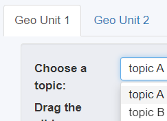

# For maintainers
This document provides an overview of how the Neighborhood Change Explorer app works, plus step-by-step instructions on:
* how to create your own version of the app
* how to update the underlying data for an existing app

For instructions on how to set up your R development environment in order to run an instance of the Neighborhood Change Explorer locally, see the [contribution guidelines](CONTRIBUTING.md).

## Basic architecture
The Neighborhood Change Explorer is built in R Shiny, a framework for building web applications using the R programming language. The app consists of three R source files:

| name | description |
| -------- | --------- |
| `ui.R` | defines the basic layout of the app + some styling parameters |
| `server.R` | defines how the map & charts are rendered + how the various controls interact with the visualizations & with each other |
| `global.R` | defines how the data are loaded into the app + some app-wide formatting parameters (e.g. colors and fonts) and miscellaneous functions |

The actual data are loaded in from RDS files in the `data/` folder, and the contents of the welcome page and the about page are rendered from markdown files stored in the `dialog/` folder. 

When the app runs, every R object defined in `global.R` is made available to both the UI and the server, without the need for import statements. See the R Shiny documentation on [two-file Shiny apps](https://shiny.posit.co/r/articles/build/two-file/) and [scoping](https://shiny.posit.co/r/articles/improve/scoping/) to learn more about this architecture.

## Basic configuration of the Neighborhood Change Explorer

The `data_preprocessing/` folder of this repository includes a script called `pull_data.R` which does not run as part of the app itself, but rather is meant to be modified and run by app maintainers in order to set up the data files that are used by a given instance of the Neighborhood Change Explorer. 

Specifically, the names, data sources, and configuration parameters for all of the topics displayed by a Neighborhood Change Explorer instance are defined within the `APP_CONFIG` object in `pull_data.R`. `APP_CONFIG` is set up as a nested list of _**geographic units**_, which contain or more _**topics**_, which in turn contain one or more _**indicators**_.

```
APP_CONFIG <- list(
  "geo unit 1" = list(
    geoms = geo_unit_1_geoms, 
    topics = list(
      "topic A" = list(
        ... # parameters for topic A
        summary_indicators = list(
          "first indicator" = list(
            ... # parameters for the first indicator of topic A
          ),
          "second indicator" = list(
            ... # parameters for the second indicator of topic A
          )
          ... # other indicators for topic A
        )
      ),
      "topic B" = list(
        ... # parameters for topic B, including indicators
      ),
      ... # other topics
    )
  ),
  "geo unit 2" = list(
    geoms = geo_unit_2_geoms, 
    topics = list(
    ... # topics for geo unit 2
    )
  ),
  ... # other geographic units
)
```

Examples of geographic units include "census tracts" and "neighborhoods". Each geographic unit becomes a tab on the app. Tabs are displayed from left to right in the order in which they're declared in `APP_CONFIG`. The declared names of geographic units should be entered in all lower case, but they will be converted into title case when displayed on tabs.

The value for each `geoms` parameter should be a variable defined earlier in `pull_data.R` containing the polygon/multipolygon geographic features that make up your study area. The ["Preparing geographic features"](#preparing-geographic-features) section of this document describes how to read geographic features into an R variable.

Examples of topics include "Age" and "Housing Occupancy". Each topic declared for a given geographic unit becomes an entry on that tab's drop-down menu. Topic entries are displayed from top to bottom in the order in which they're declared in `APP_CONFIG`. The names of topics appear on the app exactly as they are declared.

Examples of indicators within an "Age" topic might include "Young adult (20-34) share of population" or "Total population aged 65+". Indicator options are displayed from top to bottom in the order in which they're declared in `APP_CONFIG`. The names of indicators appear on the app exactly as they are declared.

For example, if the above pseudocode were to be used in a new instance of the Neighborhood Change Explorer, it would look like this:



Each combination of geographic unit, topic, and indicator constitutes a unique _**variable**_. Variables are the fundamental unit of analysis within the Neighborhood Change Explorer. `ui.R` and `server.R` are basically large functions that are designed to display data about one variable at a time in response to user selections.

## Setting up data for the Neighborhood Change Explorer

Both tabular data and geographic information are needed for each topic in the Neighborhood Change Explorer. In general, the steps required to add a new topic to the Neighborhood Change Explorer are:

1. If a new set of geographic features is needed, save them into the `geoms/` folder
2. Prepare a csv file with tabular data and store it in the `csv/` folder
3. Modify the `APP_CONFIG` variable within `pull_data.R` to specify parameters for the topic
4. Run `pull_data.R` in order to create or update an RDS file for the topic within the `data/` folder as well as to update `APP_CONFIG.rds`

To update the underlying data for an existing topic, use steps 2 and 4. To update the parameters for an existing topic, use steps 3 and 4.

### Preparing geographic features

Geographic features are ingested using the [read_sf() function](https://r-spatial.github.io/sf/reference/st_read.html), which accepts most geospatial file formats (e.g. geojson, shapefile, etc). The recommended approach is to save a file containing a set of non-overlapping geographic features (polygon or multipolygon) into the `geoms/` folder of this repo, and then modify or add a line near the top of `pull_data.R` to read that file into an R variable that can then be referred to in `APP_CONFIG`. For example, a hypothetical version of the Neighborhood Change Explorer displaying data for counties and zip code tabulation areas might have lines of code that look like this:

```
county_geoms <- read_sf('../geoms/my_counties.geojson')
zcta_geoms <- read_sf('../geoms/my_zctas.geojson')
```

Note that each specified set of geographic features must have an attribute called GEOID which uniquely identifies each feature.

Another thing to note is that currently, the Neighborhood Change Explorer does not automatically detect an optimal map centering and zoom level for a given set of geographic features (see issue #37). Until it does, the lon/lat of the center of the map and the map [zoom level](https://leafletjs.com/examples/zoom-levels/) can be set by modifying the numbers specified in the setView() statement within `server.R`:

```
setView(-71.075, 42.318, zoom = 12)
```

### Preparing tabular data

Tabular data are ingested using R's read.csv() function, which expects a csv file. One of the parameters to be specified for each topic in the `APP_CONFIG` variable within `pull_data.R` is the filepath of the csv file containing the tabular data for that topic. 

The csv file should have one row for each geographic area with data in a given year. There are three required column names: GEOID (which should uniquely identify each geographic area and correspond with the GEOID attribute of the geographic features), NAME (the display label for each geographic area), and YEAR.

All other columns in the csv file for a given topic should represent **_categories_** within each topic. For example, the topic of housing occupancy might have just two categories, occupied housing units and vacant housing units, which are represented in the example rows below using the column aliases "occ" and "vac":

| GEOID | NAME | vac | occ | YEAR |
| -------- | --------- | -------- | ------ | -------- |
| 25025060800 | Census Tract 608 | 226 | 1418 | 1980 |
| 25025070202 | Census Tract 702.02 | 125 | 1113 | 1980 |
| 25025070202 | Census Tract 702.02 | 141 | 1186 | 1990 |
| ... | ... | ... | ... | ... |

Topics with more than two categories (e.g. age brackets or racial groups) will have more than two columns besides GEOID, NAME, and YEAR in their csv files. Also note that for any topic, the order of columns from left to right does not matter. 

#### How the app handles missing tabular data

Any rows in the tabular data with blank data values for one or more years will result in the corresponding geographic areas being shaded in gray on the map across all years in a given topic, and those areas won't be able to be map-selected for custom aggregation. Handling blank values in this way is useful for displaying census geographies with little to no population, and ensures that the bar and line charts won't look buggy due to selected areas having null data values. Any non-blank data from other years for these geographies will still be included in the place-wide totals that are displayed on the line and bar charts when no areas are selected on the map.

If years of missing data for particular areas are excluded entirely from the tabular data (instead of leaving in rows with blank values), those areas will be shaded normally for years with data, they will still be selectable, and the shapes will simply disappear when moving the time slider over the years without data, as demonstrated below:


If an individual area with no rows for one or more years is selected, data for the non-missing years will still be plotted on the bar and line charts, but any excluded years will be blank on the bar chart and not have markers on the line chart.


## Configuring topics and defining indicators

The configuration of each variable is defined by a set of _**parameters**_ within `APP_CONFIG`, including parameters for entire topics as well as parameters for specific indicators within topics. 

As illustrated in the [basic configuration](#basic-configuration-of-the-neighborhood-change-explorer) section of this document, each geograhpic unit declared in APP_CONFIG should have a list() of topics. Each topic is itself composed of a list() of topic parameters, as illustrated below. One of those topic parameters is summary_indicators, which is where each indicator is defined by its list() of indicator parameters.

```
"topic A" = list(
  topic_param1 = topic_param1_value, 
  topic_param2 = topic_param2_value, 
  ...
  summary_indicators = list(
    "indicator1_displayname" = list(
      indicator1_param1 = indicator1_param1_value, 
      indicator1_param2 = indicator1_param2_value, 
      ...
    ),
    "indicator2_displayname" = list(
      indicator2_param1 = indicator2_param1_value, 
      indicator2_param2 = indicator2_param2_value, 
      ...
    )
    ... # other indicators, as desired
  )
)
```

For some topics, it may only make sense to have one indicator, but for other topics, particularly ones with a larger number of categories, a larger number of indicators may be possible and desirable to implement.

### Topic parameters

| parameter | required? | description | example value |
| ------ | ---- | ------ | ----- |
| data_code | required | a short string of characters unique to the topic, which will also be the name for the corresponding .RDS file in the `data/` folder | `"hbicttp"` |
| agg_func | required | ------ | `sum` |
| sb_csv | required | ------ | `"csv/hbic_tract_totpop_sex_bins.csv"` |
| cb_csv | optional | ------ | `"csv/hbictpop_cb.csv"` |
| barTitle | required | bar chart title for the topic | `"Population by sex"` |
| barhoverformat | required | [D3 format code](https://github.com/d3/d3-format/tree/v1.4.5#d3-format) for the numbers that appear when users hover over bars on the bar chart | `",.0f"` (to show 0 decimal places with commas separating thousands) |
| barCats | required | ------ | `list("Occupied" = "occ", "Vacant" = "vac")` |
| summary_indicators | required | ------ |  |
| source | required | citation information to display for the topic | `"U.S. Census Bureau, 1950-2020 Decennial Censuses, IPUMS-NHGIS, University of Minnesota, www.nhgis.org; BPDA Research Division Analysis"` |
| note | optional | any additional note about the topic to be displayed between the bar chart and line chart | `"Note: In 1950 and 1960, the only race/ethnicity categories on the Census were White, Black, and Other."` |

what should the four csvs / dfs be called? Summary vs (binned? categories?) is one dimension. (citywide? placewide? total area?) vs (subcity? sub place? individual areas?)

I think I will eventually rename the csv parameters to the following:
areas_categories_csv
totalarea_categories_csv_override
areas_summary_csv_override
totalarea_summary_csv_override

### Indicator parameters

For some topics, it may only make sense to have one indicator, but for other topics, particularly ones with a larger number of categories, a larger number of indicators may be possible and desirable to implement.

| parameter | required? | description | example |
| ------ | ---- | ------ | ----- |
| summary_expression | yes | An R expression object showing how to compute an indicator as a function of the column aliases for the topic categories | `rlang::expr(foreign / (foreign + native))` |
| ss_csv | optional | ------ | `"csv/hbictpop_ss.csv"` |
| cs_csv | optional | ------ | `"csv/hbictpop_cs.csv"` |
| linehoverformat | required | [D3 format code](https://github.com/d3/d3-format/tree/v1.4.5#d3-format) for the numbers that appear when users hover over points on the line chart | `".0%"` (to show a fraction between 0 and 1 as a rounded percentage) |

etc fill out indicator params

## how pull_data.R prepares data for

if you saved a new set of geographies, add x to app config. if a new topic for an existing set, add y within that topic.

pull_data creates four data frames for each topic based on a given csv: (this is out of date - pull_data most of the time just includes the sb df in the rds - other dfs only included if they are overrides)

| name | alias | required fields | fields which uniquely identify each row | type of R object | where it's used |
| -------- | --------- | --------- | ---------- | ---------- | -------- |
| sb_df | subcity bins | GEOID, NAME, CATEGORY, YEAR, VALUE | GEOID, CATEGORY, YEAR | data frame | bar chart |
| ss_df | subcity summary | GEOID, NAME, YEAR, SUMMARY_VALUE | GEOID, YEAR | simple features object | line chart, map |
| cb_df | citywide bins | CATEGORY, YEAR, VALUE | CATEGORY, YEAR | data frame | bar chart |
| cs_df | citywide summary | YEAR, SUMMARY_VALUE | YEAR | data frame | line chart |

ss_df is a simple features object because that is the data frame that is used for the map. sb_df and cb_df are used on the bar chart, and cs_df and ss_df are used on the line chart.

sb and cb are topic specific, ss and cs change by indicator

For each topic, all four data frames are bundled together into a list and stored in an RDS file named after the variable code. Each file within the `data/` folder contains all the data for a given geographic unit and topic. 

use pull data to both create new data files and modify existing ones. walk through the example of modifying a category name.

also talk about the use case of overrides and walk through an example of that.

## Publishing and deployment

shiny apps account

outside of rstudio, https://docs.posit.co/shinyapps.io/getting-started.html#deploying-applications

using rstudio, (re)publish button

clearing global environment before publishing

intermittent timeouts that sometimes still work