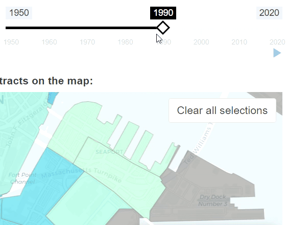

# For maintainers
This document provides a more detailed overview of how the Neighborhood Change Explorer app works, aimed at providing enough information for people with basic R programming experience to: 
* create their own version of the Neighborhood Change Explorer
* update the underlying data for an existing instance of the Neighborhood Change Explorer

For instructions on how to set up your R development environment in order to run an instance of the Neighborhood Change Explorer locally, see the [contribution guidelines](CONTRIBUTING.md).

## Basic architecture
The Neighborhood Change Explorer is built in R Shiny, a framework for building web applications using the R programming language. The app consists of three R source files:

| name | description |
| -------- | --------- |
| `ui.R` | defines the basic layout of the app + some styling parameters |
| `server.R` | defines how the map & charts are rendered + how the various user controls interact with the visualizations & with each other |
| `global.R` | defines how the data are loaded into the app + some app-wide formatting parameters (e.g. colors and fonts) and miscellaneous functions |

The actual data are loaded in from RDS files in the `data/` folder, and the contents of the welcome page and the about page are rendered from markdown files stored in the `dialog/` folder. 

When the app runs, every R object defined in `global.R` is made available to both the UI and the server, without the need for import statements. See the R Shiny documentation on [two-file Shiny apps](https://shiny.posit.co/r/articles/build/two-file/) and [scoping](https://shiny.posit.co/r/articles/improve/scoping/) to learn more about this architecture.

### Publishing and deployment

The Neighborhood Change Explorer is published through Shiny Apps. In RStudio, this is done by opening one of the source code files for the app and using the Publish button. It's also possible to [deploy Shiny apps outside of RStudio](https://docs.posit.co/shinyapps.io/getting-started.html#deploying-applications).

In RStudio, it's a good rule of thumb to clear the global environment before clicking the Publish/Republish button - not doing so can sometimes introduce issues or errors. 

An additional note is that the deployment process through RStudio will sometimes print an SSL error message, but this does not always mean that the deployment failed. Before trying to deploy again, wait a minute and visit the URL of the published app to confirm whether your changes went through or not.

## Basic configuration of the Neighborhood Change Explorer

The `data_preprocessing/` folder of this repository includes a script called `prep_data.R` which does not run as part of the app itself, but rather is meant to be modified and run by app maintainers in order to set up the data files and overall configuration of a given instance of the Neighborhood Change Explorer. 

Specifically, the names, data sources, and configuration parameters for all of the topics displayed by a Neighborhood Change Explorer instance are defined within the `APP_CONFIG` object in `prep_data.R`. The `APP_CONFIG` object is set up as a nested list of _**geographic units**_, which contain or more _**topics**_, which in turn contain one or more _**indicators**_.

```
APP_CONFIG <- list(
  "geo unit 1" = list(
    geoms = geo_unit_1_geoms, 
    topics = list(
      "topic A" = list(
        ... # parameters for topic A
        summary_indicators = list(
          "first indicator" = list(
            ... # parameters for the first indicator of topic A
          ),
          "second indicator" = list(
            ... # parameters for the second indicator of topic A
          )
          ... # other indicators for topic A
        )
      ),
      "topic B" = list(
        ... # parameters for topic B, including indicators
      ),
      ... # other topics
    )
  ),
  "geo unit 2" = list(
    geoms = geo_unit_2_geoms, 
    topics = list(
    ... # topics for geo unit 2
    )
  ),
  ... # other geographic units
)
```

Examples of geographic units include `"census tracts"` and `"neighborhoods"`. Each geographic unit becomes a tab on the app. Tabs are displayed from left to right in the order in which they're declared in `APP_CONFIG`. The declared names of geographic units should be entered in all lower case, but they will be converted into title case when displayed on tabs.

The value for each `geoms` parameter should be a variable defined earlier in `prep_data.R` containing the polygon/multipolygon geographic features that make up your study area. The [preparing geographic features](#preparing-geographic-features) section of this document describes how to read geographic features into an R variable.

Examples of topics include `"Age"` and `"Housing Occupancy"`. Each topic declared for a given geographic unit becomes an entry on that tab's drop-down menu. Topic entries are displayed from top to bottom in the order in which they're declared in `APP_CONFIG`. The names of topics appear on the app exactly as they are declared.

Examples of indicators within an `"Age"` topic might include `"Young adult (20-34) share of population"` or `"Total population aged 65+"`. Indicator options are displayed from top to bottom in the order in which they're declared in `APP_CONFIG`. The names of indicators appear on the app exactly as they are declared.

Each combination of geographic unit, topic, and indicator constitutes a unique _**variable**_. Variables are the fundamental unit of analysis within the Neighborhood Change Explorer. `ui.R` and `server.R` are basically large functions that are designed to display data about one variable at a time in response to user selections.

## Setting up data for the Neighborhood Change Explorer

Both tabular data and geographic information are needed for each topic in the Neighborhood Change Explorer. In general, the steps required to set up data for the Neighborhood Change Explorer are:

0. If necessary, save the geographic features for the topic into the `geoms/` folder of this repo, noting the requirements in the [preparing geographic features](#preparing-geographic-features) section of this document.
1. Create a csv file for the topic using the format specified in the [preparing tabular data](#preparing-tabular-data) section of this document and save it in the `csv/` subfolder of the `data_preprocessing/` folder. For topics that require [overriding default calculations](#overriding-default-calculations), create and save those additional csv files.
2. Open `prep_data.R` (located within the `data_preprocessing/` folder of this repo) and modify the `APP_CONFIG` variable, adding all the required and optional [parameters](#configuring-topics-and-defining-indicators) desired for the topic, and adding references to any new geographic features.
3. Set the working directory of your R session to the source file location of `prep_data.R`. 
4. Run `prep_data.R`. This will create or update an RDS file for the topic within the `data/` folder and will also update `APP_CONFIG.rds`. To confirm that the changes went through successfully, run the Neighborhood Change Explorer app by opening and running `global.R`.

To update the underlying data for an existing topic without altering any parameters, use steps 1, 3, and 4. To update the parameters for an existing topic, use steps 2, 3, and 4.

### Preparing geographic features

Geographic features are ingested using the [read_sf() function](https://r-spatial.github.io/sf/reference/st_read.html), which accepts most geospatial file formats (e.g. geojson, shapefile, etc). The recommended approach is to save a file containing a set of non-overlapping geographic features (polygon or multipolygon) into the `geoms/` folder of this repo, and then modify or add a line near the top of `prep_data.R` to read that file into an R variable that can then be referred to in `APP_CONFIG`. For example, a hypothetical version of the Neighborhood Change Explorer displaying data for counties and zip code tabulation areas might have lines of code that look like this:

```
county_geoms <- read_sf('../geoms/my_counties.geojson')
zcta_geoms <- read_sf('../geoms/my_zctas.geojson')
```

Note that each specified set of geographic features must have an attribute called GEOID which uniquely identifies each feature.

Another thing to note is that currently, the Neighborhood Change Explorer does not automatically detect an optimal map centering and zoom level for a given set of geographic features (see issue #37). Until it does, the lon/lat of the center of the map and the map [zoom level](https://leafletjs.com/examples/zoom-levels/) can be set by modifying the numbers specified in the setView() statement within `server.R`:

```
setView(-71.075, 42.318, zoom = 12)
```

### Preparing tabular data

Tabular data are ingested using R's read.csv() function, which expects a csv file. One of the parameters to be specified for each topic (`areas_categories_csv`) is the filepath of a csv file containing the tabular data for that topic. The [Configuring topics](#configuring-topics-and-defining-indicators) section of this document goes into more detail about how the various parameters are defined and what they do.

The required csv file for each topic should have one row for each geographic area for each year. There are three required column names: `GEOID` (which should uniquely identify each geographic area and correspond with the `GEOID` attribute of the geographic features), `NAME` (the display label for each geographic area), and `YEAR`.

All other columns in the csv file for a given topic should represent the **_categories_** for that topic. For example, the topic of housing occupancy might have just two categories, occupied housing units and vacant housing units, which are represented in the example rows below using the **_column aliases_** `occ` and `vac`:

| GEOID | NAME | vac | occ | YEAR |
| -------- | --------- | -------- | ------ | -------- |
| 25025060800 | Census Tract 608 | 226 | 1418 | 1980 |
| 25025070202 | Census Tract 702.02 | 125 | 1113 | 1980 |
| 25025070202 | Census Tract 702.02 | 141 | 1186 | 1990 |
| ... | ... | ... | ... | ... |

Column aliases should not use spaces or other special characters besides underscores, and they should not start with numbers. Topics with more than two categories (e.g. age brackets or racial groups) will have more than two column aliases in their csv files alongside the `GEOID`, `NAME`, and `YEAR` columns. Also note that for any topic, the order of columns from left to right does not matter. 

Most of the time, the column aliases for a given topic correspond with the categories that are displayed on the bar chart of the tool. However, it may sometimes be useful to include columns of data which aren't displayed on the bar chart, but which are used for calculating certain indicators for the map and line chart (i.e. for measures of density, you may want a column with the land area of each feature). The `barCats` parameter (described more in the [Topic parameters](#topic-parameters) section of this document) is used to specify the display names of the column aliases whose values should be displayed on the bar chart.

#### How the app handles missing tabular data

Any rows in the tabular data with blank data values for one or more years will result in the corresponding geographic areas being shaded in gray on the map across all years in a given topic, and those areas won't be able to be map-selected for custom aggregation. Handling blank values in this way is useful for displaying certain kinds of data (e.g. census geographies with little to no population for some years), and ensures that the bar and line charts won't look buggy due to selected areas having null data values. Any non-blank data from other years for these geographies will still be included in the place-wide totals that are displayed on the line and bar charts when no areas are selected on the map.

If years of missing data for particular areas are excluded entirely from the tabular data (instead of leaving in rows with blank cell values), those areas will be shaded normally for years that do have data, and they will still be selectable for those years. The shapes will simply disappear when moving the time slider over the years without data, as demonstrated below:



If an individual area with no rows for one or more years is selected, data for the non-missing years will still be plotted on the bar and line charts, but any excluded years will be blank on the bar chart and not have markers on the line chart.

#### Overriding default calculations

In most cases, `areas_categories_csv` is the only piece of tabular data that is needed to initialize a topic. The tool sums up category totals on the fly in order to display data on the bar chart by category for the city as a whole and for user-selected areas. For the line chart, the tool uses the `summary_expression` parameter to calculate the data that are displayed on the map and line chart for a given indicator (see the [indicator parameters](#indicator-parameters) section of this document for an example). However, there are some situations where it may be desirable to override these default aggregations. 

For example, one may wish to exclude data for certain areas within the larger city from being displayed on the map (e.g. census geographies with little to no population), while still ensuring that citywide totals match official totals that include every area of the city. There are two ways to hide data for a subset of areas on the map while still having correct citywide totals. One option is to omit those areas from `areas_categories_csv` and then use the `totalarea_categories_csv` parameter to point to a csv file with the citywide category totals that should be displayed instead of the default aggregations. Another option is to keep the data for those areas within `areas_categories_csv` but use the `additional_null_geoms` parameter to specify the `NAME`s of those areas, which prompts the tool to gray them them out and make non-selectable on the map, just like areas with missing data for individual years. 

There are also cases where it may be useful to override the default values for given indicator because the calculation of the `summary_expression` is an approximation of the true value. For example, to display median household incomes based on data that specifies the numbers of households in each income bucket, one might use a Pareto interpolation function within the `summary_expression` in order to have the tool estimate median incomes for arbitrary combinations of tracts or neighborhoods. However, if the actual median values for individual areas or for a wider place are available from the original data source, it may be desirable for the tool to display those instead of having it display estimates. The summary values for individual sub-city areas can be overridden using the `areas_summary_csv` parameter, and citywide summary values can be overridden using the `totalarea_summary_csv` parameter.

The following table provides an overview of the required column names and unique identifier columns for each of the tabular data files that one can supply as a parameter for a given topic / indicator:

| name | required? | type of parameter | required columns | unique identifier columns |
| -------- | --------- | ------ | ------ | ------- |
| `areas_categories_csv` | required | topic parameter | `GEOID`, `NAME`, `YEAR`, column aliases | `GEOID`, `YEAR` | 
| `areas_summary_csv` | optional | indicator parameter | `GEOID`, `NAME`, `YEAR`, `SUMMARY_VALUE` | `GEOID`, `YEAR` | 
| `totalarea_categories_csv` | optional | topic parameter | `YEAR`, column aliases | `YEAR` |
| `totalarea_summary_csv` | optional | indicator parameter | `YEAR`, `SUMMARY_VALUE` | `YEAR` |

## Configuring topics and defining indicators

The configuration of each variable is defined by a set of _**parameters**_ within `APP_CONFIG`, which is initialized in the `prep_data.R`. There are parameters for entire topics as well as parameters for specific indicators within topics.

As illustrated in the [basic configuration](#basic-configuration-of-the-neighborhood-change-explorer) section of this document, each geographic unit declared in `APP_CONFIG` should have a list() of topics. Each topic is itself composed of a list() of topic parameters, as illustrated below. One of those topic parameters is `summary_indicators`, which is where each indicator is defined by its list() of indicator parameters.

```
"topic A" = list(
  topic_param1 = topic_param1_value, 
  topic_param2 = topic_param2_value, 
  ...
  summary_indicators = list(
    "indicator1_displayname" = list(
      indicator1_param1 = indicator1_param1_value, 
      indicator1_param2 = indicator1_param2_value, 
      ...
    ),
    "indicator2_displayname" = list(
      indicator2_param1 = indicator2_param1_value, 
      indicator2_param2 = indicator2_param2_value, 
      ...
    )
    ... # other indicators, as desired
  )
)
```

For some topics, it may only make sense to have one indicator, but for other topics, particularly ones with a larger number of categories, it may be possible and desirable to add a larger number of indicators.

Below are lists of the required and optional parameters for topics and indicators.

### Topic parameters

| parameter | required? | description | example value(s) |
| ------ | ---- | ------ | ----- |
| `data_code` | required | a short string of characters unique to the topic, which will also be the name for the corresponding .RDS file in the `data/` folder | `"hbicttp"` |
| `areas_categories_csv` | required | see the [Preparing tabular data](#preparing-tabular-data) section of this document | `"csv/hbic_tract_totpop_sex_bins.csv"` |
| `totalarea_categories_csv` | optional | see the section on [overriding default calculations](#overriding-default-calculations) | `"csv/hbictpop_cb.csv"` |
| `barTitle` | required | bar chart title for the topic | `"Population by sex"` |
| `barhoverformat` | required | [D3 format code](https://github.com/d3/d3-format/tree/v1.4.5#d3-format) specifying a number format for the numbers that appear when users hover over bars on the bar chart | `",.0f"` (to show 0 decimal places with commas separating thousands) |
| `bartickprefix` | optional | string to prepend to the numbers on the y axis of the bar chart | `"$"` |
| `barCats` | required | `list()` associating each column alias from the tabular data with its display name for the bar chart. Columns whose aliases aren't declared in barCats will not appear on the bar chart. | `list("Occupied" = "occ", "Vacant" = "vac")` |
| `summary_indicators` | required | `list()` of indicator names and parameters | see the [Configuring topics](#configuring-topics-and-defining-indicators) section above |
| `source` | required | citation information to display for the topic | `"U.S. Census Bureau, 1950-2020 Decennial Censuses, IPUMS-NHGIS, University of Minnesota, www.nhgis.org; BPDA Research Division Analysis"` |
| `note` | optional | any additional note about the topic to be displayed between the bar chart and line chart | `"Note: In 1950 and 1960, the only race/ethnicity categories on the Census were White, Black, and Other."` |
| `additional_null_geoms` | optional | see the section on [overriding default calculations](#overriding-default-calculations) | `c("Census Tract 9811", "Census Tract 9813")` |

### Indicator parameters

| parameter | required? | description | example value(s) |
| ------ | ---- | ------ | ----- |
| `summary_expression` | required | An R expression object showing how to compute an indicator as a function of the column aliases for the topic categories | `rlang::expr(vac / (occ + vac))` to calculate a housing vacancy rate |
| `citywide_comparison` | required | specify whether the line chart should include a dashed line showing the citywide trend for the given indicator (typically, you'd only use this for indicators that are indexes or percentages) | either `TRUE` or `FALSE` |
| `areas_summary_csv` | optional | see the Overrides section of this document | `"csv/hbictpop_ss.csv"` |
| `totalarea_summary_csv` | optional | see the Overrides section of this document | `"csv/hbictpop_cs.csv"` |
| `hoverformat` | required | [D3 format code](https://github.com/d3/d3-format/tree/v1.4.5#d3-format) for the numbers that appear when users hover over points on the line chart | `".0%"` (to show a decimal between 0 and 1 as a rounded percentage) |
| `tickformat` | required | [D3 format code](https://github.com/d3/d3-format/tree/v1.4.5#d3-format) for the numbers on the y axis of the line chart. To use the default plotly number format, use `tickformat = ""` | `".0%"` (to show a decimal between 0 and 1 as a rounded percentage) |
| `tickprefix` | optional | string to prepend to the numbers on the y axis of the line chart and the map legend | `"$"` |