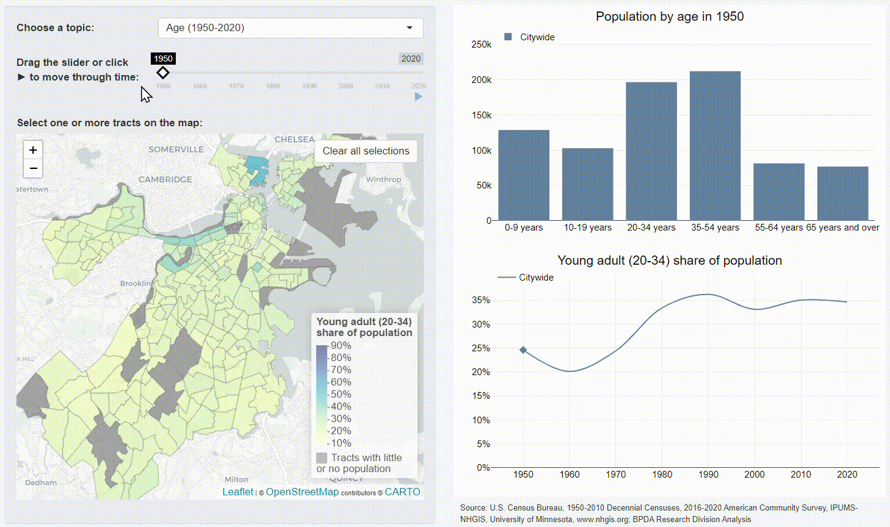

# Neighborhood Change Explorer
Explore how neighborhoods and cities have changed over time through interactive data visualizations. 

### Data visualization features

* simultaneous view of multiple types of variation (over space, over time, and within a population)
* users "move through time" at their own pace using interactive controls
* multi-selection of small geographies for users to create custom areas of interest (supported by on-the-fly data aggregation)

### About

The Neighborhood Change Explorer was originally built by the Research Division of the Boston Planning and Development Agency to display demographic and housing data for the city of Boston. However, it is designed to be a more generalized framework for the interactive visualization of aggregated geographic time-series data. 

To learn more about how the app works and how you can create your own version of it, see the [about page](ABOUT.md).

Primary author/maintainer: [@mciethan](https://www.github.com/mciethan)

Want to report a bug or suggest a feature? Create an [issue](https://github.com/bpda-research-division/neighborhood-change/issues). 

Interested in contributing? See the [contribution guidelines](CONTRIBUTING.md).